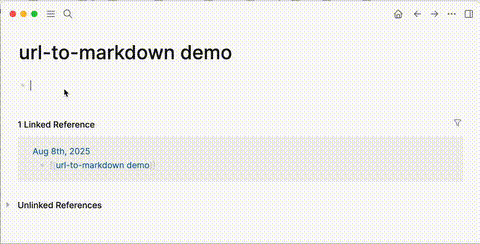
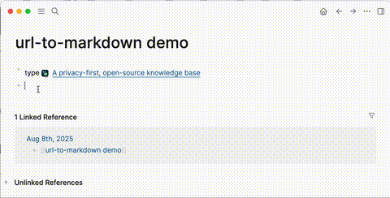

# URL to Markdown (Logseq Plugin)

This plugin converts pasted or typed URLs into clean Markdown links with the page title and optional favicon.

You type or paste a URL into a Logseq page; the plugin replaces the raw URL with a Markdown link, like this:

- _raw URL_: My note taking application: <https://logseq.com>

- _markdown with favicon_: My note taking application:  [A privacy-first, open-source knowledge base](https://logseq.com)

- _markdown without favicon_: My note taking application: [A privacy-first, open-source knowledge base](https://logseq.com)

## Install

You can install the plugin in two ways:

### From the Logseq Marketplace (not yet available)

- Open Logseq → Plugins → Marketplace.
- Search for “URL to Markdown”.
- Click Install and enable the plugin.

### From the GitHub repo releases

- Download the latest release from the [GitHub releases page](https://github.com/rudifa/url-to-markdown/releases).
- In Logseq: Plugins → Load unpacked plugin → select the `dist` folder inside the downloaded release.

## Configure

Open Logseq → Plugins → URL to Markdown → Settings. Options:

- Enable Favicons (default: on)
  - Add a site icon to the link.
- Favicon Size (default: 16)
  - Icon size in pixels.
- Favicon Position (default: before)
  - Place the favicon before or after the link text.

## Use

There are three common flows:

### Type a URL

Type a URL directly into your Logseq page.

Plugin will convert it automatically to a Markdown link with the page title (and favicon if enabled). Press Enter to see the result.

### Paste a URL

Paste any text containing http(s) URLs into your Logseq page.

Plugin will convert it automatically ... press Enter to see the result.

### Convert existing URLs

If you have existing pages with raw URLs, the plugin will automatically convert the URLs to Markdown links when you open these pages.

## Shared links

Some sites (e.g. ChatGPT) have the option to create shared links. If you paste a shared link into your Logseq page, the plugin will get the actual page title, while pasted basic, non-shared link the plugin will get only a generic title (e.g. "ChatGPT").

## How it works (brief)

- Detects raw URLs in page blocks and replaces them with Markdown links.
- Fetches page titles via Microlink API and favicons via Google’s S2 favicon service when favicons are enabled.

## Privacy & Networking

To enrich links, the plugin makes network requests to:

- <https://api.microlink.io> – to fetch the page title.
- <https://www.google.com/s2/favicons> – to fetch site favicons.

If you prefer not to use favicons, disable “Enable Favicons” in settings.

If you work offline and add URLs, the plugin won’t be able to fetch titles and favicons. However, it will convert them later, when you open such pages while online.

## Troubleshooting

- Nothing happens when pasting/typing a URL

  - Ensure the plugin is enabled and you have the latest version.
  - Check your internet connection (required for titles/favicons).
  - Some pages don’t expose titles/metadata; the URL may be left as-is.
  - Try disabling favicons to see if conversion works without the icon.

- Wrong or missing title
  - The external metadata service may not have the correct info. You can edit the link text manually after conversion.

## Support

Issues, ideas, or questions? Open an issue on GitHub:
[Open an issue](https://github.com/rudifa/url-to-markdown/issues)
